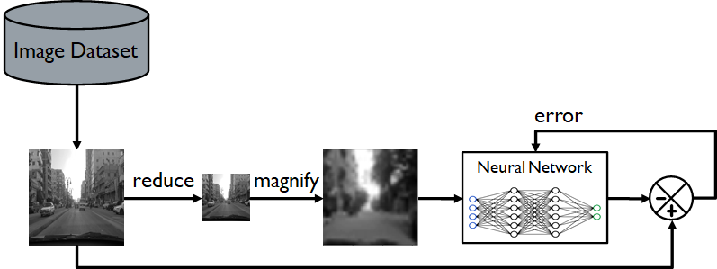

# Single-Image Super-Resolution on Grayscale Images
**Author:** [Richard Hemphill](mailto:rhemphill2019@my.fit.ed) 
**School:** [Florida Institute of Technology](https://www.fit.edu/) 
**Class:** [ECE5268 Theory of Neural Networks](http://catalog.fit.edu/preview_course_nopop.php?catoid=1&coid=927&) 
**Instructor:** [Dr. Georgios C. Anagnostopoulos](https://www.fit.edu/faculty-profiles/3/georgios-anagnostopoulos/) 
**Assignment:** Individual Class Project 

# Description
Using small-sized grayscale images, construct a neural network architecture that will downscale (magnify) the images by a factor of 2.  The following image shows the concept where a magnified image maintains the reduces resolution and thus blury.  A neural network can be trained to enhance features in the image so that upon magnification (i.e. super resolution) it looks close to the original.

# Goal
The goal of the project is to constuct Python code to import and extract a dataset, take shrinken images with the original and train a CNN (Convolutional Neural Network) to magnify and subsequently enhance an image back to the orignal as shown in the following figure.

